# Process Design Document (PDD) - Working Draft
**Team Name:** Group 2
**Project Title:** Personal Networking Outreach Assistant 
**Current Phase:** Week 4 (Advanced Logic Design)

---

## Part 1: Process Mapping (The "As-Is" State)
https://github.com/msacouto-ffld/data6900-group-project/blob/main/milestone-1/pdd-v2.md
---
## [Part 2: The Core Capability (The Linear Worker)]
https://github.com/msacouto-ffld/data6900-group-project/blob/main/milestone-2/MVW.md
---

## Part 3: The Intelligent Network (Week 4 Additions)

*In Week 4, we wrap the Linear Core in advanced logic to handle variety (Routing) and quality (Looping).*

### 3.1 The Architecture Strategy
*Which Advanced Patterns are you deploying to fix the "Real World Complexity"? Check at least one.*
*   [X] **The Router (Branching):** To handle different types of inputs (e.g., separating Spam from Valid Requests).
*   [X] **The Evaluator-Optimizer (Looping):** To ensure quality/safety (e.g., checking the Draft before sending).
*   [ ] **The Orchestrator-Workers (Parallel):** To handle complex, multi-step research.

### 3.2 The Advanced Logic Map (Mermaid)
*(Update your diagram. It should now contain Diamonds (Decisions) or Circles (Loops) wrapping around your nodes.)*

```mermaid
flowchart TD
    %% ── ENTRY ──────────────────────────────────────────────
    START([⚡ Job Posting]) --> B1

    %% ══════════════════════════════════════════════════════
    %% STEP B — Identify Company + Job Title + Background
    %% ══════════════════════════════════════════════════════

    B1[🤖 B1 Gatekeeper: Extraction]
    B1 --> B2[⚖️ B2 Judge: Reasoning]
    B2 --> B_CRITIC[🔍 B2 Critic: Verdict Quality Check]
    B_CRITIC --> B_LOOP{Verdict Acceptable?}
    B_LOOP -- No: Too Generic / Too Long --> B2
    B_LOOP -- Yes --> B_ROUTER{Company and University Signals Present?}
    B_ROUTER -- Yes: Anchor-first path --> B3_A[✍️ B3 Worker: Query with Company + University Anchors]
    B_ROUTER -- No: Skill-first path --> B3_B[✍️ B3 Worker: Query with Skill + Title Focus]
    B3_A --> C1
    B3_B --> C1

    %% ══════════════════════════════════════════════════════
    %% STEP C — Analyze Profiles for Relevance
    %% ══════════════════════════════════════════════════════

    C1[🤖 C1 Gatekeeper: Profile Extraction]
    C1 --> C_ROUTER{JSON Fields Complete?}
    C_ROUTER -- No: Missing / Hallucinated Fields --> C1_FALLBACK[🔄 C1 Fallback: Re-Extraction with Strict Null Rules]
    C1_FALLBACK --> C2
    C_ROUTER -- Yes: Clean JSON --> C2
    C2[⚖️ C2 Judge: Relevance Scoring]
    C2 --> C_CRITIC[🔍 C2 Critic: Tier + Rank Check]
    C_CRITIC --> C_LOOP{Score Granular and Ranked?}
    C_LOOP -- No: Flat Tiers / Inflation --> C2
    C_LOOP -- Yes --> C3[✍️ C3 Worker: Lead Summary]

    %% ══════════════════════════════════════════════════════
    %% STEP D — Draft Customized Message
    %% ══════════════════════════════════════════════════════

    C3 --> D_ROUTER{All Key Fields Intact?}
    D_ROUTER -- No: Skills Dropped / Interests Rewritten --> D1_FALLBACK[🔄 D1 Fallback: Re-Parse with Field Validation]
    D_ROUTER -- Yes: Clean Pass-Through --> D2
    D1_FALLBACK --> D2
    D2[⚖️ D2 Judge: Personalization Strategy]
    D2 --> D3[✍️ D3 Worker: Draft Message]
    D3 --> D_CRITIC[🔍 D3 Critic: Tone + CTA Check]
    D_CRITIC --> D_LOOP{Professional Tone + Clear Ask + with Timeline?}
    D_LOOP -- No: Too Informal / Vague CTA --> D3
    D_LOOP -- Yes --> HUMAN

    %% ── EXIT ──────────────────────────────────────────────
    HUMAN([🛠️ Human Review & Send])

    %% ══════════════════════════════════════════════════════
    %% STYLING
    %% ══════════════════════════════════════════════════════

    %% Week 3 nodes — Orange
    style B1 fill:#FFF4DD,stroke:#E0C070
    style B2 fill:#FFF4DD,stroke:#E0C070
    style B3_A fill:#FFF4DD,stroke:#E0C070
    style B3_B fill:#FFF4DD,stroke:#E0C070
    style C1 fill:#FFF4DD,stroke:#E0C070
    style C2 fill:#FFF4DD,stroke:#E0C070
    style C3 fill:#FFF4DD,stroke:#E0C070
    style D2 fill:#FFF4DD,stroke:#E0C070
    style D3 fill:#FFF4DD,stroke:#E0C070

    %% New Router nodes — Green
    style B_ROUTER fill:#E6FFFA,stroke:#2C7A7B,stroke-width:2px
    style C_ROUTER fill:#E6FFFA,stroke:#2C7A7B,stroke-width:2px
    style D_ROUTER fill:#E6FFFA,stroke:#2C7A7B,stroke-width:2px

    %% New Critic nodes — Green
    style B_CRITIC fill:#E6FFFA,stroke:#2C7A7B,stroke-width:2px
    style C_CRITIC fill:#E6FFFA,stroke:#2C7A7B,stroke-width:2px
    style D_CRITIC fill:#E6FFFA,stroke:#2C7A7B,stroke-width:2px

    %% Fallback nodes — Green
    style C1_FALLBACK fill:#E6FFFA,stroke:#2C7A7B,stroke-width:2px
    style D1_FALLBACK fill:#E6FFFA,stroke:#2C7A7B,stroke-width:2px
```



### 3.3 The Orchestrator Logic
*Define the step-by-step execution plan (The "Operating System"). This replaces the simple "1-2-3" sequence.*

#### WORKFLOW VARIABLES
```
# Inputs


# Gatekeeper outputs


# Judge outputs


# Critic outputs

```

#### WORKFLOW CONDITIONS
##### Router (Pre-Gatekeeper)
```

```

##### Critic (Post-Judge Evaluator Loop)
```
# Initialize loop


    # Feedback to Judge
    
```

---

### 3.4 New Component Definitions (The Modules)
*Define the Specs and Prompts for the NEW tools you added (Router or Critic). You do not need to redefine the tools from Part 2.*

#### **[Module A: The Router Configuration]**

**Tool Name:** Input Qualification Router
  *   **Input Variable:**
      *   `{{transcript}}` (String), `{{vendor_csv}}` (String)
  *   **Output Categories:** (What are the specific pass/fail criteria?)
      *   VALID
        * Required financial facts are explicitly present in authoritative sources (CSV preferred).
        * Numeric values are concrete (no hedging language).
      * AMBIGUOUS
        * Required facts exist but are vague, approximate, or transcript-only.
        * Extraction is possible only with forced inference flags.
      * INSUFFICIENT
        * One or more mandatory fields cannot be grounded in any source.
        * Downstream automation must fail closed or escalate.
  *   **R.A.F.T. Prompt Draft:**
      ```
      # Role
      
      # Audience

      
      # Format
     
      
      # Task
     
      
     
      
      # Rules
    
      ```

#### **[Module B: The Evaluator Configuration]**

*   **Tool Name:** Judge Critic / Evaluator Loop (NEW)
*   **Input Variable:** 
    * {{judge_xml_output}} (XML)
      * <thinking>: Step-by-step reasoning
      * <verdict>: Proposed decision (APPROVE or REJECT)
    * {{gatekeeper_json_output}} (JSON)
      * Structured financial facts, including inferred flags
*   **Evaluation Rubric:** (What are the specific pass/fail criteria?)
    | Rule                                    | Description                                                                                                      |
    | :-------------------------------------- | :--------------------------------------------------------------------------------------------------------------- |
    | **Mandatory Fields Present**            | All critical fields (`requested_shift_amount`, `target_line_item`, `current_overhead_reference`) must exist.     |
    | **No Over-Confidence on Inferred Data** | Fields marked `"inferred": true` must trigger a conditional or REJECT verdict if they are critical for approval. |
    | **Budget Limit Enforcement**            | Requested shift must not exceed $10,000.                                                                         |
    | **MSA Trigger Rule**                    | Any shift > $5,000 must trigger MSA check.                                                                       |
    | **Overhead Qualification**              | `target_line_item` must have a validated overhead classification.                                                |
    | **Fail-Closed Principle**               | If any precondition fails, the final verdict is downgraded to REJECT or NEEDS REVIEW.                            |

*   **R.A.F.T. Prompt Draft:**
    ```
    # Role
    
    # Audience
 
    
    # Format
    
    # Task

    
    # Rules

    ```
  

---

### 3.5 Advanced Simulation Log (Proof of Robustness)
*Provide a chat log showing the Logic handling a complex case.*

**Scenario: The Edge Case**
*   **Input:** 
  ```
  
  ```
*   **Trace:**
  ```
  *
  ```
* **Observations from Simulation**
  * 
