# Process Design Document (PDD) - Milestone 1: Process Analysis
**Team Name:** Group 2
**Project Title:** LinkedIn Lead Generator
**Target Workflow:** Personal Daily Task

---

## Part 1: Process Mapping (The "As-Is" State)

### 1.1 The Scenario
A student wants to improve chances in the job market by manually generating leads on LinkedIn to connect with professionals who may provide referrals, insights, or interview opportunities. The process involves multiple manual steps, from identifying relevant profiles to drafting and sending personalized connection requests.

For each job posting, the student must extract key details, search for professionals at the company, evaluate their relevance, and write a customized message. Because personalization is required for every outreach attempt, the time required increases with the number of leads pursued.

### 1.2 The "As-Is" Diagram (Mermaid)

```mermaid
flowchart TD
    A[⚡ Job Posting] --> B[📦 Identify Company + Job Title + School/Common Background]
    B --> C[🛠️ Analyze Profile for Relevance; Pain Point: Time consuming]
    C --> D[🛠️ Draft Customized Message; Pain Point: Time consuming]
    D --> F[🛠️ Send Connection]

    %% Highlight the most time consuming bottlenecks (B, C, and D)
    style B fill:#f90
    style C fill:#f90
    style D fill:#f90
```

### 1.3 Pain Point Diagnosis
*   **The Bottleneck:** The main bottleneck occurs between "Identifying Company + Job Title + School/Common Background", “Analyze Profile” and “Draft Customized Message.” This stage requires reviewing unstructured profile information, exercising judgment about strategic value, and writing a personalized outreach message. It is the most cognitively demanding and time-intensive step, and it must be repeated for every potential connection.

*   **The Cost:** The student typically attempts 8–12 outreach connections per week. Profile analysis takes approximately 3–5 minutes per person, and drafting a customized message takes 7–10 minutes. This results in approximately 2–3 hours per week spent primarily on evaluation and message drafting, representing roughly 70–80% of total process time. Additional costs include cognitive fatigue, inconsistent message quality, and reduced outreach volume due to overthinking.

---

## Part 2: Opportunity Analysis (The Business Case)

### 2.1 The 3-Filter Analysis
| Activity                                                             | Pain (1-10) | Feasibility (1-10) | Risk (1-10) | Rationale                                                                                                       |
| -------------------------------------------------------------------- | ----------- | ------------------ | ----------- | --------------------------------------------------------------------------------------------------------------- |
| Evaluate profile for relevance                                       | 9           | 8                  | 4           | Requires interpreting unstructured profile information, identifying shared background, and judging strategic value. Highly repetitive and cognitively demanding. |
| Draft personalized message                                           | 9           | 8                  | 5           | Writing customized outreach is time-intensive and mentally taxing. Message quality directly impacts response rates. AI can generate strong drafts while preserving human review. |
| Search LinkedIn for relevant professionals                           | 7           | 8                  | 4           | Filtering by company, title, and shared background is structured and repeatable. AI can improve efficiency through ranking and prioritization. |
| Extract company + role + criteria from job posting                   | 6           | 9                  | 3           | Information extraction from job descriptions is well-suited for AI summarization and structured output generation. |
| Send connection request                                              | 4           | 9                  | 6           | Technically easy to automate, but full automation increases platform and account risk. Human control is preferred. |

### 2.2 The "Why AI?" Justification
| Activity                                           | Recommended Approach | Reasoning                                                                                                  |
| -------------------------------------------------- | -------------------- | ---------------------------------------------------------------------------------------------------------- |
| Extract company + role + criteria                  | AI / Automation      | AI can quickly summarize job postings and extract structured information needed for targeting relevant professionals. |
| Search and rank relevant professionals             | AI / Automation      | AI can filter and prioritize candidates based on structured criteria such as company, role, and shared background. |
| Evaluate profile for relevance                     | AI-assisted (Hybrid) | AI can summarize profile highlights and identify alignment signals, reducing review time while allowing human validation. |
| Draft personalized message                         | AI-assisted (Hybrid) | AI can generate tailored draft messages using extracted profile data, reducing cognitive load and drafting time. Human review maintains authenticity. |
| Send connection request                            | Human                | Final sending remains human-controlled to reduce platform risk and ensure intentional outreach. |
---

## Part 3: Scope of Automation (The Setup for Week 3)

### 3.1 The Target Zone
From the AS-IS workflow, the Minimal Viable Workflow (MVW) we identified was:

Target steps to automate: Extract company + role + criteria →  Analyze Profile for Relevance  → Draft Customized message

Keep Human: Final evaluation of strategic fit → Final message edits → Sending connection requests

Summary Table:
| Step                                         | Current Responsibility | TO-BE Responsibility                |
| -------------------------------------------- | ---------------------- | ----------------------------------- |
| Extract company + role + criteria            | Human                  | AI                                  |
| Analyze profile for relevance                | Human                  | AI-assisted + Human validation      |
| Draft personalized message                   | Human                  | AI-assisted + Human refinement      |
| Send connection request                      | Human                  | Human                               |

### 3.2 The Hypothesis
*   By automating job criteria extraction, candidate filtering, and first-draft message generation, we expect to reduce the time spent on profile evaluation and drafting by approximately 50–70%. This would reduce total weekly effort from approximately 2–3 hours to approximately 1–1.5 hours per week, while maintaining or improving message quality and consistency through structured AI support and human review.
