# Process Design Document (PDD) - Milestone 1: Process Analysis
**Team Name:** Group 2
**Project Title:** LinkedIn Lead Generator
**Target Workflow:** Personal Daily Task

---

## Part 1: Process Mapping (The "As-Is" State)

### 1.1 The Scenario
Current students are aware that networking is a powerful tool for landing job interviews, 

### 1.2 The "As-Is" Diagram (Mermaid)
*(Use ChatGPT to help you generate a `graph TD` flow chart of the current MANUAL steps. You must clearly label the manual bottlenecks.)*

```mermaid
flowchart TD
    %% AS-IS LinkedIn Lead Generation Workflow

    A[⚡ Job Posting] --> B[📦 Identify Company + Job Title + School/Common Background]
    B --> C[🛠️ Analize Profile]
    C --> D[🛠️ Overthink/Draft Customized Message]
    D --> F[🛠️ Send connection]
```

### 1.3 Pain Point Diagnosis
*   **The Bottleneck:** (Which specific step in the diagram is the slowest or most error-prone?)
*   **The Cost:** (Quantify the pain: e.g., "5 hours/week" or "Error rate of 20%").

---

## Part 2: Opportunity Analysis (The Business Case)
*Grading Criteria: Logically justifies why this is a good fit for GenAI.*

### 2.1 The 3-Filter Analysis
| Activity                                                             | Pain (1-10) | Feasibility (1-10) | Risk (1-10) | Rationale                                                                                                       |
| -------------------------------------------------------------------- | ----------- | ------------------ | ----------- | --------------------------------------------------------------------------------------------------------------- |
| Open profile → evaluate relevance → customize message → send request | 8           | 6                  | 7           | This is the most time-consuming step, requires judgment, and mistakes (weak messages) can reduce response rate. |
| Overthink/customize each message                                     | 9           | 5                  | 6           | High mental effort; automation is challenging due to personalization, but template guidance could help.         |
| Searching for relevant people                                        | 7           | 9                  | 4           | Can be partially automated via AI filters; relatively low risk if criteria are clear.                           |
| Decision based on shared background                                  | 6           | 8                  | 3           | Straightforward evaluation based on known criteria; low-risk and feasible to automate filtering.                |
| Sending connection request                                           | 5           | 9                  | 5           | Easy to automate; Not necessary to automate                           |

### 2.2 The "Why AI?" Justification
*(Explain why Standard Software (like Excel formulas) isn't enough. Does this task require "Reasoning," "Summarization," or "Tone Adjustment"?)*

---

## Part 3: Scope of Automation (The Setup for Week 3)
*Grading Criteria: Identifies relevant automation opportunities.*

### 3.1 The Target Zone
*(Look at your diagram in Part 1.2 (_The Minimal Viable Workflow_). Which specific nodes will you replace with AI in Week 3?)*
*   **We will replace:** [Step Name]
*   **We will keep human:** [Step Name]

### 3.2 The Hypothesis
*   "By automating [Step X], we expect to reduce the time spent from [Current Time] to [Target Time]."
*  **HINT**: Refer to your Segment 1 interview notes where you discussed 'Hours Saved' and 'Cost of Error' to fill this out.
> EXAMPLE: _By implementing an AI Context Guardian to cross-reference meeting transcripts with the Master Budget Excel, we will reduce the budget reconciliation time from 2 hours to 30 seconds and reduce the financial risk of unauthorized shifts to near zero._
