# Process Design Document (PDD) - Milestone 1: Process Analysis
**Team Name:** Group 2
**Project Title:** LinkedIn Lead Generator
**Target Workflow:** Personal Daily Task

---

## Part 1: Process Mapping (The "As-Is" State)

### 1.1 The Scenario
A student wants to improve chances in the job market by manually generating leads on LinkedIn to connect with people who can land job interviews or gather career insights. The process involves multiple manual steps, from identifying relevant profiles to sending personalized connection requests.

### 1.2 The "As-Is" Diagram (Mermaid)

```mermaid
flowchart TD
    %% AS-IS LinkedIn Lead Generation Workflow

    A[⚡ Job Posting] --> B[📦 Identify Company + Job Title + School/Common Background]
    B --> C[🛠️ Analize Profile]
    C --> D[🛠️ Overthink/Draft Customized Message]
    D --> F[🛠️ Send connection]
```

### 1.3 Pain Point Diagnosis
*   **The Bottleneck:** (Which specific step in the diagram is the slowest or most error-prone?)
*   **The Cost:** (Quantify the pain: e.g., "5 hours/week" or "Error rate of 20%").

---

## Part 2: Opportunity Analysis (The Business Case)

### 2.1 The 3-Filter Analysis
| Activity                                                             | Pain (1-10) | Feasibility (1-10) | Risk (1-10) | Rationale                                                                                                       |
| -------------------------------------------------------------------- | ----------- | ------------------ | ----------- | --------------------------------------------------------------------------------------------------------------- |
| Open profile → evaluate relevance → customize message → send request | 8           | 6                  | 7           | This is the most time-consuming step, requires judgment, and mistakes (weak messages) can reduce response rate. |
| Overthink/customize each message                                     | 9           | 5                  | 6           | High mental effort; automation is challenging due to personalization, but template guidance could help.         |
| Searching for relevant people                                        | 7           | 9                  | 4           | Can be partially automated via AI filters; relatively low risk if criteria are clear.                           |
| Decision based on shared background                                  | 6           | 8                  | 3           | Straightforward evaluation based on known criteria; low-risk and feasible to automate filtering.                |
| Sending connection request                                           | 5           | 9                  | 5           | Easy to automate; Not necessary to automate                           |

### 2.2 The "Why AI?" Justification
| Activity                                           | Recommended Approach | Reasoning                                                                                                  |
| -------------------------------------------------- | -------------------- | ---------------------------------------------------------------------------------------------------------- |
| Searching for relevant people                      | AI / Automation      | AI can filter candidates based on company, title, and background, reducing hours spent.                    |
| Decision based on shared background                | AI / Automation      | Matching criteria is rule-based; AI can score relevance efficiently.                                       |
| Open profile → evaluate → customize message → send | Hybrid (AI-assisted) | AI can suggest message templates and highlight key details, but human personalization improves engagement. |
| Overthink/customize each message                   | Human + AI Template  | Human judgment needed to maintain authenticity; AI can reduce cognitive load by suggesting drafts.         |
| Sending connection request                         | Automation           | Once the message is ready, requests can be sent automatically with minimal risk.                           |

---

## Part 3: Scope of Automation (The Setup for Week 3)
*Grading Criteria: Identifies relevant automation opportunities.*

### 3.1 The Target Zone
From the AS-IS workflow, the Minimal Viable Workflow (MVW) we identified was:

Automate: Candidate search & background relevance evaluation → [📦 Company + Job Title + School/Common Background] and [🛠️ Overthink/Draft Customized Message]

Keep Human: Finalized personalized messages & sending requests 

Summary Table:
| Step                                         | Current Responsibility | TO-BE Responsibility                          |
| -------------------------------------------- | ---------------------- | --------------------------------------------- |
| Search for candidates & filter by background | Human                  | AI                                            |
| Open profile & evaluate                      | Human                  | AI-assisted / Human review                    |
| Draft personalized message                   | Human                  | AI-assisted / Human review                    |
| Send connection request                      | Human                  | Human / Semi-automated with prepared messages |

### 3.2 The Hypothesis
*   By automating candidate search and relevance filtering, we expect to reduce the time spent from 1–2 hours/week to 0.25-0.5 hours/week, while maintaining or improving the quality of connections and reducing human error associated with missing relevant contacts.
