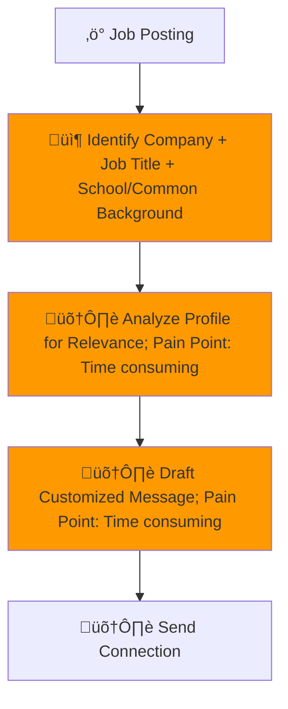
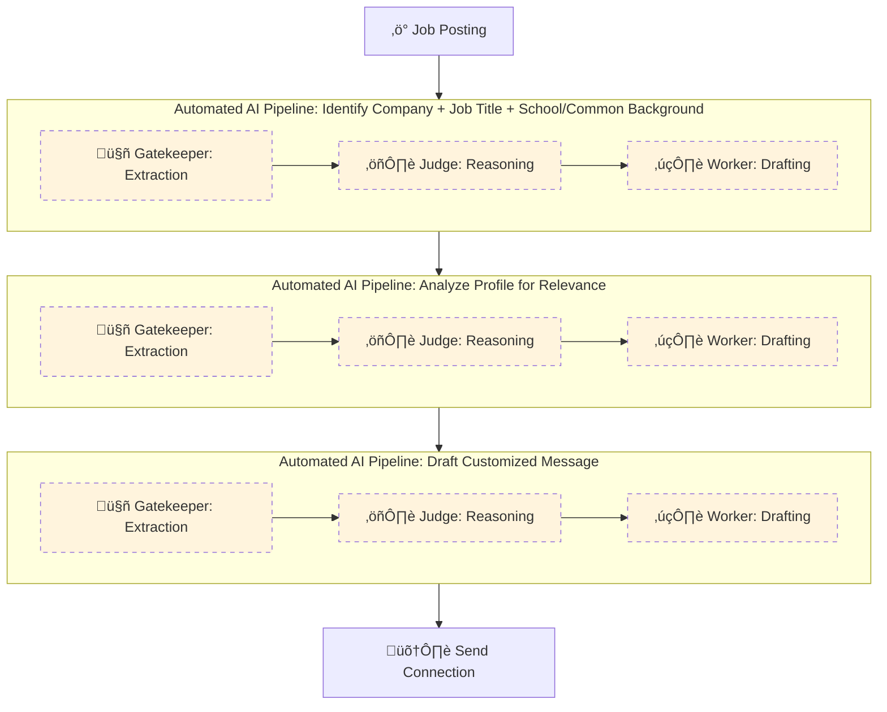

#  Process Design Document (PDD) - Milestone 2: MVW Design


### Process Design Document (PDD) - Phase 1 Complete
**Team Name:** Group #2

**Project Title:** LinkedIn Lead Generator

**Status:** Milestone 2 (Solution Design)

---

## [Part 1: Process Analysis]
# Process Design Document (PDD) - Milestone 1: Process Analysis
**Team Name:** Group 2
**Project Title:** LinkedIn Lead Generator
**Target Workflow:** Personal Daily Task

---

## Part 1: Process Mapping (The "As-Is" State)

### 1.1 The Scenario
A student wants to improve chances in the job market by manually generating leads on LinkedIn to connect with professionals who may provide referrals, insights, or interview opportunities. The process involves multiple manual steps, from identifying relevant profiles to drafting and sending personalized connection requests.

For each job posting, the student must extract key details, search for professionals at the company, evaluate their relevance, and write a customized message. Because personalization is required for every outreach attempt, the time required increases with the number of leads pursued.


### 1.2 The "As-Is" Diagram (Mermaid)



### 1.3 Pain Point Diagnosis
*   **The Bottleneck:** The main bottleneck occurs between "Identifying Company + Job Title + School/Common Background", “Analyze Profile” and “Draft Customized Message.” This stage requires reviewing unstructured profile information, exercising judgment about strategic value, and writing a personalized outreach message. It is the most cognitively demanding and time-intensive step, and it must be repeated for every potential connection.

*   **The Cost:** The student typically attempts 8–12 outreach connections per week. Profile analysis takes approximately 3–5 minutes per person, and drafting a customized message takes 7–10 minutes. This results in approximately 2–3 hours per week spent primarily on evaluation and message drafting, representing roughly 70–80% of total process time. Additional costs include cognitive fatigue, inconsistent message quality, and reduced outreach volume due to overthinking.

---

## Part 2: Opportunity Analysis (The Business Case)


### 2.1 The 3-Filter Analysis
| Activity                                                             | Pain (1-10) | Feasibility (1-10) | Risk (1-10) | Rationale                                                                                                       |
| -------------------------------------------------------------------- | ----------- | ------------------ | ----------- | --------------------------------------------------------------------------------------------------------------- |
| Evaluate profile for relevance                                       | 9           | 8                  | 4           | Requires interpreting unstructured profile information, identifying shared background, and judging strategic value. Highly repetitive and cognitively demanding. |
| Draft personalized message                                           | 9           | 8                  | 5           | Writing customized outreach is time-intensive and mentally taxing. Message quality directly impacts response rates. AI can generate strong drafts while preserving human review due to hallucination and tone ajustment risks.  |
| Search LinkedIn for relevant professionals                           | 7           | 8                  | 4           | Filtering by company, title, and shared background is structured and repeatable. AI can improve efficiency through ranking and prioritization. |
| Extract company + role + criteria from job posting                   | 6           | 9                  | 3           | Information extraction from job descriptions is well-suited for AI summarization and structured output generation. |
| Send connection request                                              | 4           | 9                  | 6           | Technically easy to automate, but full automation increases platform and account risk. Human control is preferred. |

### 2.2 The "Why AI?" Justification
| Activity                                           | Recommended Approach | Reasoning                                                                                                  |
| -------------------------------------------------- | -------------------- | ---------------------------------------------------------------------------------------------------------- |
| Extract company + role + criteria                  | AI / Automation      | AI can quickly summarize job postings and extract structured information needed for targeting relevant professionals. |
| Search and rank relevant professionals             | AI / Automation      | AI can filter and prioritize candidates based on structured criteria such as company, role, and shared background. |
| Evaluate profile for relevance                     | AI-assisted (Hybrid) | AI can summarize profile highlights and identify alignment signals, reducing review time while allowing human validation. |
| Draft personalized message                         | AI-assisted (Hybrid) | AI can generate tailored draft messages using extracted profile data, reducing cognitive load and drafting time. Human review maintains authenticity. |
| Send connection request                            | Human                | Final sending remains human-controlled to reduce platform risk and ensure intentional outreach. |
---

## Part 3: Scope of Automation (The Setup for Week 3)


### 3.1 The Target Zone
From the AS-IS workflow, the Minimal Viable Workflow (MVW) we identified was:

Automate: Extract job criteria ‚Üí Search and rank relevant professionals ‚Üí Summarize profile highlights ‚Üí Generate draft personalized message

Keep Human: Final evaluation of strategic fit ‚Üí Final message edits ‚Üí Sending connection requests

Summary Table:
| Step                                         | Current Responsibility | TO-BE Responsibility                |
| -------------------------------------------- | ---------------------- | ----------------------------------- |
| Extract company + role + criteria            | Human                  | AI                                  |
| Search for professionals                     | Human                  | AI-assisted                         |
| Evaluate profile for relevance               | Human                  | AI-assisted + Human validation      |
| Draft personalized message                   | Human                  | AI-assisted + Human refinement      |
| Send connection request                      | Human                  | Human                               |


### 3.2 The Hypothesis
*   By automating job criteria extraction, candidate filtering, and first-draft message generation, we expect to reduce the time spent on profile evaluation and drafting by approximately 50–70%. This would reduce total weekly effort from approximately 2–3 hours to approximately 1–1.5 hours per week, while maintaining or improving message quality and consistency through structured AI support and human review.

---

## Part 2: The "To-Be" Solution (Milestone 2)

### 2.1 The "To-Be" Map


---

### 2.2 The R.A.F.T. Implementation (The Prompts)

**Automating Step B: Identify Company + Job Title + School/Common Background**

**Prompt 1 (Gatekeeper):**
```
#### Role
Gatekeeper AI: Extractor of relevant job posting information

#### Audience
Machine (downstream Judge node)

#### Format
JSON:
{
  "company": "",
  "role": "",
  "tasks_skills": ""
}

#### Task
- Receive the unstructured text of a job posting.
- Extract all relevant information required to identify potential leads:
  - Company name
  - Type of role
  - Key tasks and skills required
- Output the extracted information in JSON format.
- Do not make assumptions; extract only explicit or strongly implied information from the job posting.

```
**Prompt 2 (Judge):**
```
#### Role
Judge AI: Reasoning engine to determine best parameters for identifying leads

#### Audience
Machine (downstream Worker node)

#### Format
XML with tags:
<thinking> ... </thinking>
<verdict> ... </verdict>

#### Task
- Receive JSON output from Gatekeeper (company, role, tasks/skills).
- Determine the most effective parameters to identify relevant leads, including:
  - People at the same company or related industry
  - Shared university
  - Similar skills as described in the job posting
- Explain reasoning in the <thinking> tag.
- Provide final recommended search parameters in the <verdict> tag.
- Ensure all reasoning is explicit to prevent skipping logic.

```
**Prompt 3 (Worker):**
```
#### Role
Worker AI: Lead Search Query Generator

#### Audience
Human or Machine (ready-to-use LinkedIn search)

#### Format
Plain Text

#### Task
- Receive:
  - JSON from Gatekeeper
  - XML from Judge (<verdict>)
- Combine inputs to generate a single LinkedIn Boolean search string that can be pasted directly into LinkedIn.
- Ensure the string is fully formed, with no placeholders, and captures all relevant filters: company, role, skills, education, and additional parameters.
- Maintain clarity and proper Boolean syntax so it runs immediately in LinkedIn.


```
**Automating Step C: Analyze Profile for Relevance**
**Prompt 1 (Gatekeeper):**
```
#### Role
Gatekeeper AI: Extractor of lead profile information

#### Audience
Machine (downstream Judge node)

#### Format
JSON:
{
  "current_company": "",
  "current_role": "",
  "skills": [],
  "interests": [],
  "university": ""
}

#### Task
- Receive a LinkedIn profile of a lead (Headline, Activity, Job Experience, Skills, Interests, Education).
- Extract structured facts relevant for evaluating lead relevance:
  - Current company
  - Current role
  - Skills
  - Interests
  - University
- Output as JSON for downstream reasoning.


```
**Prompt 2 (Judge):**
```
#### Role
Judge AI: Evaluate lead relevance

#### Audience
Machine (downstream Worker node)

#### Format
XML with tags:
<thinking> ... </thinking>
<verdict> ... </verdict>

#### Task
- Receive JSON from Gatekeeper.
- Compare lead profile with job posting criteria and search parameters.
- Provide reasoning in <thinking>, highlighting matches and gaps in:
  - Company/industry
  - Role similarity
  - Skills alignment
  - University/education
  - Interests
- Provide final relevance verdict in <verdict> as High, Medium, or Low.
- Ensure explicit reasoning to prevent skipping steps.


```
**Prompt 3 (Worker):**
```
#### Role
Worker AI: Lead Profile Summarizer

#### Audience
Human (review for prioritization)

#### Format
Plain Text

#### Task
- Receive:
  - JSON from Gatekeeper
  - XML from Judge (<thinking> + <verdict>)
- Combine inputs to generate a concise, human-readable summary of the lead profile:
  - Current Company
  - Current Role
  - Skills
  - Interests
  - University
  - Relevance verdict
- Output should be easy to read and ready for human review.

```
**Automating Step D: Draft Customized Message**
**Prompt 1 (Gatekeeper):**
```
#### Role
Gatekeeper AI: Extractor for message drafting

#### Audience
Machine (downstream Judge node)

#### Format
JSON:
{
  "company": "",
  "role": "",
  "skills": [],
  "interests": [],
  "university": "",
  "relevance": ""
}

#### Task
- Receive Lead Summary from Step C (Plain Text).
- Parse and structure all relevant fields for message drafting:
  - Company, Role, Skills, Interests, University, Relevance
- Output as JSON for downstream Judge and Worker nodes.

```
**Prompt 2 (Judge):**
```
#### Role
Judge AI: Message Personalization Strategist

#### Audience
Machine (downstream Worker node)

#### Format
XML with tags:
<thinking> ... </thinking>
<verdict> ... </verdict>

#### Task
- Receive JSON from Gatekeeper.
- Determine:
  1. Which profile points are most persuasive to include.
  2. Appropriate tone/focus based on relevance.
  3. Rank personalization priorities (university, skills, role, company, interests).
- Provide detailed reasoning in <thinking>.
- Output recommended points and tone in <verdict> for message drafting.


```
**Prompt 3 (Worker):**
```
#### Role
Worker AI: Personalized Message Generator

#### Audience
Human (to review before sending)

#### Format
Plain Text

#### Task
- Receive:
  - JSON from Gatekeeper
  - XML from Judge (<thinking> + <verdict>)
- Generate a fully drafted, human-friendly, ready-to-send personalized message:
  - Include highlighted persuasive points (university, skills, role, company)
  - Apply tone recommended by Judge
- Output should be immediately readable, editable, and ready for human review before sending.
```

---

### 2.3 The Tool Specifications (The Engineer's Audit)
*Now, audit your prompts above against these strict Engineering Specs. Does your prompt actually deliver what the Spec demands?*

#### **Step B | Tool A: The Gatekeeper (Extraction)**
*   **Goal:** Extract structured data from job posting.
*   **Input Variable:** `{job posting description}´ (String)
*   **Output Schema (JSON):**
    *   `{
  "company": ,
  "role": ,
  "tasks_skills": 
}´
*   **Failure Mode:** If no information was extracted, output `null` across all fields.

#### **Step B | Tool B: The Judge (Reasoning)**
*   **Goal:** Establish criteria to find relevant people.
*   **Input Variable:** `{{json from previous rules}}`
*   **Context Rules:** Sticking to JSON output from previous node
*   **Output Schema (XML):** `<thinking>` and `<verdict>`

#### **Step B | Tool C: The Worker (Drafting)**
*   **Goal:** Generate the ready-to-paste LinkedIn query.
*   **Input Variable:** `{{verdict}}`
*   **Tone/Style:** Single Boolean LinkedIn Query

#### **Step C | Tool A: The Gatekeeper (Extraction)**
*   **Goal:** Extract structured data from job posting.
*   **Input Variable:** `{job posting description}´ (String)
*   **Output Schema (JSON):**
    *   `{}´
*   **Failure Mode:** If no information was extracted, output null across all fields.

#### **Step C | Tool B: The Judge (Reasoning)**
*   **Goal:** Establish criteria to find relevant people.
*   **Input Variable:** `{{json from previous rules}}`
*   **Context Rules:** Sticking to JSON output from previous node
*   **Output Schema (XML):** `<thinking>` and `<verdict>`

#### **Step C | Tool C: The Worker (Drafting)**
*   **Goal:** Generate the ready-to-paste LinkedIn query.
*   **Input Variable:** `{{verdict}}`
*   **Tone/Style:** Single Boolean LinkedIn Query

---

### 2.4 "Proof of Life" (Simulation Log)

#### Step B
> **Input:** 
> `{{About the job About the role: Join our fast-growing Global Product Management Data Science team and help transform Gartner’s Client Experience Digital Platform—the essential destination for IT and business leaders worldwide. As a data scientist, you’ll leverage advanced analytics and machine learning to create intelligent, scalable solutions that deliver real value and enhance every step of our clients’ journey. In this role, you will lead complex data science projects in partnership with cross-functional teams, driving the development of advanced AI-powered chatbot systems that deliver intelligent, personalized experiences at scale. You’ll architect and implement cutting-edge conversational AI tools—including intelligent search, recommendation engines, and context-aware content systems—while ensuring seamless integration with enterprise platforms. What You Will Do Lead data science projects in close collaboration with Data Engineering, Application development, Product owners and business leaders to deliver high-value business capabilities Architect and build sophisticated AI-powered chatbot systems that provide intelligent, personalized client experiences at scale Design and implement advanced tools that power conversational AI capabilities, including intelligent search, recommendation engines, and context-aware content retrieval systems Design and implement Model Context Protocol (MCP) servers to enable seamless integration between AI agents, enterprise systems, and external tools Build user profiling and personalization models to deliver tailored chatbot experiences Be accountable for high-quality data science solutions with respect to accuracy, coverage, scalability, stability, and business adoption Take ownership of algorithms and drive enhancements/optimizations based on business requirements with proper documentation and code-reusability Leverage internal and external data to understand client's company-level priorities and deliver targeted support Collaborate with senior leadership on long-term vision, strategy, and solution roadmaps aligned with business objectives Pitch ideas, present solutions, and influence senior leaders and executive stakeholders with strong business value propositions Stay on top of fast-moving AI/ML models and technologies, particularly in LLMs, conversational AI, and agentic systems Collaborate with engineering and product teams to launch MVPs and iterate quickly Independently plan and drive complex data science projects that deliver measurable business value Mentor junior data scientists on chatbot development, LLM applications, and best practices What You Will Need 6-8 years hands-on experience building conversational AI systems, chatbots, LLM applications, or other advanced machine learning/artificial intelligence solutions to drive business impact Master's Degree or PhD in a quantitative field (math, computer science, engineering, etc.) required Strong communication skills in technical and business domains with demonstrated ability to translate quantitative analysis into actionable business strategies and influence executive leadership Working experience in some of the following data science areas: Large Language Models (LLMs) and Generative AI Conversational AI, chatbot development, and dialogue systems Natural Language Processing and text mining Search and Recommendation systems Prompt engineering, LLM fine-tuning, and model optimization AI agent architectures and orchestration Strong familiarity with Model Context Protocol (MCP) and building tools for AI agents Deep understanding of Lean product principles, software development lifecycle, and machine learning life cycle Practical, intuitive problem solver with proven ability to translate business objectives into actionable data science tasks and implement state-of-the-art ML research into production systems Experience and proficiency with Python, machine learning tools (e.g., scikit-learn, spacy, nltk), deep learning frameworks (e.g., pytorch, tensorflow, huggingface), LLM frameworks (e.g., LangChain, LlamaIndex), SQL/relational databases (e.g., Oracle), NoSQL databases (e.g., MongoDB, graph database), vector databases (e.g., Pinecone, Weaviate), distributed machine learning (spark), Linux and shell scripting Experience with cloud computing services such as AWS or Azure ML Strong ability to work collaboratively across product, data science and technical stakeholders with experience mentoring data scientists Ability to work in a culture that thrives on feedback and seeks opportunities to stretch outside comfort zone Bias for action and client outcome oriented What You Will Get Competitive salary, generous paid time off policy, charity match program, Group Medical Insurance, Parental Leave, Employee Assistance Program (EAP) and more! Collaborative, team-oriented culture that embraces diversity Professional development and unlimited growth opportunities Who are we? At Gartner, Inc. (NYSE:IT), we guide the leaders who shape the world. Our mission relies on expert analysis and bold ideas to deliver actionable, objective business and technology insights, helping enterprise leaders and their teams succeed with their mission-critical priorities. Since our founding in 1979, we’ve grown to 21,000 associates globally who support ~14,000 client enterprises in ~90 countries and territories. We do important, interesting and substantive work that matters. That’s why we hire associates with the intellectual curiosity, energy and drive to want to make a difference. The bar is unapologetically high. So is the impact you can have here. What makes Gartner a great place to work? Our vast, virtually untapped market potential offers limitless opportunities – opportunities that may not even exist right now – for you to grow professionally and flourish personally. How far you go is driven by your passion and performance. We hire remarkable people who collaborate and win as a team. Together, our singular, unifying goal is to deliver results for our clients. Our teams are inclusive and composed of individuals from different geographies, cultures, religions, ethnicities, races, genders, sexual orientations, abilities and generations. We invest in great leaders who bring out the best in you and the company, enabling us to multiply our impact and results. This is why, year after year, we are recognized worldwide as a great place to work. What do we offer? Gartner offers world-class benefits, highly competitive compensation and disproportionate rewards for top performers. In our hybrid work environment, we provide the flexibility and support for you to thrive — working virtually when it's productive to do so and getting together with colleagues in a vibrant community that is purposeful, engaging and inspiring. Ready to grow your career with Gartner? Join us. Gartner believes in fair and equitable pay. A reasonable estimate of the base salary range for this role is 113,000 USD - 147,000 USD. Please note that actual salaries may vary within the range, or be above or below the range, based on factors including, but not limited to, education, training, experience, professional achievement, business need, and location. In addition to base salary, employees will participate in either an annual bonus plan based on company and individual performance, or a role-based, uncapped sales incentive plan. Our talent acquisition team will provide the specific opportunity on our bonus or incentive programs to eligible candidates. We also offer market leading benefit programs including generous PTO, a 401k match up to $7,200 per year, the opportunity to purchase company stock at a discount, and more. The policy of Gartner is to provide equal employment opportunities to all applicants and employees without regard to race, color, creed, religion, sex, sexual orientation, gender identity, marital status, citizenship status, age, national origin, ancestry, disability, veteran status, or any other legally protected status and to seek to advance the principles of equal employment opportunity. Gartner is committed to being an Equal Opportunity Employer and offers opportunities to all job seekers, including job seekers with disabilities. If you are a qualified individual with a disability or a disabled veteran, you may request a reasonable accommodation if you are unable or limited in your ability to use or access the Company’s career webpage as a result of your disability. You may request reasonable accommodations by calling Human Resources at +1 (203) 964-0096 or by sending an email to ApplicantAccommodations@gartner.com. Job Requisition ID:106861 By submitting your information and application, you confirm that you have read and agree to the country or regional recruitment notice linked below applicable to your place of residence. Gartner Applicant Privacy Link: https://jobs.gartner.com/applicant-privacy-policy For efficient navigation through the application, please only use the back button within the application, not the back arrow within your browser.}}`
> 
> **Node 1 Output:**
> `{
  "company": "Gartner",
  "role": "Data Scientist – Conversational AI / LLM",
  "tasks_skills": "Lead end-to-end data science projects; architect and build AI-powered chatbot systems; develop conversational AI tools (intelligent search, recommendation engines, context-aware content retrieval); design and implement MCP servers for AI agent integration; build user profiling and personalization models; optimize and productionize ML/LLM models; collaborate with data engineering, product, and business stakeholders; influence senior leadership and define AI strategy; mentor junior data scientists; stay current with LLMs and agentic AI. Required skills include LLMs and generative AI, NLP, chatbot/dialogue systems, prompt engineering, LLM fine-tuning, AI agents and orchestration, MCP, Python, scikit-learn, PyTorch/TensorFlow, Hugging Face, LangChain/LlamaIndex, SQL/NoSQL, vector databases (Pinecone/Weaviate), Spark, Linux, AWS/Azure ML, strong communication, and product/ML lifecycle knowledge."
}´
> 
> **Node 2 Verdict:** `<thinking> To determine the most effective parameters for identifying relevant leads, I systematically analyzed the input JSON:

1. **Company**: The target company is Gartner. Prioritizing current employees here is crucial for network relevance and context alignment.

2. **Role**: "Data Scientist – Global Product Management Data Science (Conversational AI / Chatbots)" indicates a specialized AI/data science function focused on conversational AI, LLMs, and recommendation systems. Leads with similar roles in the same or adjacent companies in AI, product management, or data science are highly relevant.

3. **Tasks and Skills**: Key responsibilities include:
   - Leading complex data science projects
   - Architecting AI-powered chatbot systems
   - Designing conversational AI tools (search, recommendation, context-aware retrieval)
   - Developing personalization models
   - Mentoring and influencing teams

   Required skills emphasize:
   - Conversational AI, LLMs, generative AI, NLP
   - AI architectures (MCP, LangChain/LlamaIndex)
   - Programming (Python), ML frameworks (PyTorch, TensorFlow, scikit-learn, HuggingFace)
   - Data engineering (SQL/NoSQL/vector databases, Spark)
   - Cloud ML platforms (AWS/Azure)
   - Strong communication and advanced degrees

4. **Derived Lead Parameters**:
   - **Company & Industry**: Look for leads at Gartner or top AI/product-focused companies (e.g., Microsoft, Google DeepMind, OpenAI, IBM Watson, Amazon Alexa). Industry relevance ensures similar challenges and expertise.
   - **Role Alignment**: Data Scientist, AI Engineer, Machine Learning Engineer, NLP Engineer, Conversational AI Specialist, Product Data Scientist.
   - **Skills Overlap**: Prioritize leads with experience in conversational AI, LLMs, NLP, recommendation systems, prompt engineering, Python, deep learning frameworks, vector databases, cloud ML platforms, and AI agent architecture.
   - **University/Advanced Degrees**: Focus on individuals with a Master’s or PhD in quantitative fields (CS, Data Science, AI, Statistics).
   - **Networking Potential**: Shared universities or prior companies can improve lead receptivity.

5. **Logic for Prioritization**:
   - Highest weight: Company match + Role match + Skill overlap
   - Medium weight: Advanced degree + industry adjacency
   - Lower weight: Shared university, minor skill overlap

The goal is to produce a focused lead list who are most likely to have comparable expertise, be in a similar network, and be receptive to outreach.

</thinking>
<verdict>
- Company: Gartner or top AI/product-focused companies (Microsoft, Google DeepMind, OpenAI, IBM Watson, Amazon Alexa)
- Role: Data Scientist, AI Engineer, Machine Learning Engineer, NLP Engineer, Conversational AI Specialist, Product Data Scientist
- Skills: Conversational AI, LLMs, generative AI, NLP, recommendation engines, prompt engineering, AI agent architectures (MCP, LangChain/LlamaIndex), Python, ML frameworks (PyTorch, TensorFlow, scikit-learn, HuggingFace), SQL/NoSQL/vector DBs, Spark, Linux, AWS/Azure ML
- Education: Master’s or PhD in quantitative field (CS, Data Science, AI, Statistics)
- Additional Parameters: Shared universities, previous experience in AI/product teams, mentorship experience, leadership in data science projects
</verdict>´

> **Final Output:** `("Data Scientist" OR "AI Engineer" OR "Machine Learning Engineer" OR "NLP Engineer" OR "Conversational AI Specialist" OR "Product Data Scientist") AND ("Conversational AI" OR "Chatbots" OR "LLM" OR "Generative AI" OR "NLP" OR "Recommendation Engine" OR "Prompt Engineering" OR "AI Agent Architecture" OR "MCP" OR "LangChain" OR "LlamaIndex") AND (Python OR PyTorch OR TensorFlow OR scikit-learn OR HuggingFace OR SQL OR NoSQL OR MongoDB OR Pinecone OR Weaviate OR Spark OR Linux OR "AWS ML" OR "Azure ML") AND (Gartner OR Microsoft OR "Google DeepMind" OR OpenAI OR "IBM Watson" OR "Amazon Alexa") AND ("Master's" OR "PhD") AND ("Computer Science" OR "Data Science" OR AI OR Statistics)´

#### Step C
> **Input:** 
> `{{X}}`
> 
> **Node 1 Output:**
> `{
}´
> 
> **Node 2 Verdict:** `{}´

> **Final Output:** `{}´

---

### 2.5 Value Definition (The KPI Dashboard)
*How will we measure success?*

| Metric Category | Current State (As-Is) | Target State (To-Be) | Estimated Impact |
| :--- | :--- | :--- | :--- |
| **Efficiency (Time)** | e.g., 20 mins/task | 1 min/task | **95% Reduction** |
| **Quality (Error)** | e.g., 10% typo rate | 0% typo rate | **Eliminated Risk** |
| **Cost (Optional)** | e.g., $50/hr labor | $0.05 API cost | **High ROI** |

### ChatGPT logs
> To generate the RAFT prompts: https://chatgpt.com/share/6993c5ac-8f64-8007-a5ae-5a17a0ba1d65
>
> To audit the prompts or get the outputs: 
 - Step B. Tool A: https://chatgpt.com/share/6994f2a5-8410-8007-9979-18e331a2f22e
 - Step B. Tool B: https://chatgpt.com/share/6994f779-6f10-8007-a498-ab5610a02ac7
 - Step B. Tool C: 
```
