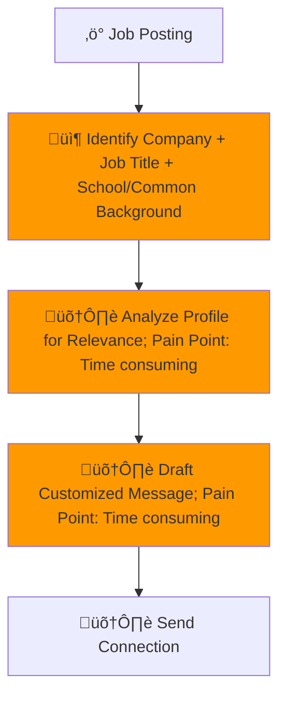

#  Process Design Document (PDD) - Milestone 2: MVW Design


### Process Design Document (PDD) - Phase 1 Complete
**Team Name:** Group #2

**Project Title:** LinkedIn Lead Generator

**Status:** Milestone 2 (Solution Design)

---

## [Part 1: Process Analysis]
# Process Design Document (PDD) - Milestone 1: Process Analysis
**Team Name:** Group 2
**Project Title:** LinkedIn Lead Generator
**Target Workflow:** Personal Daily Task

---

## Part 1: Process Mapping (The "As-Is" State)

### 1.1 The Scenario
A student wants to improve chances in the job market by manually generating leads on LinkedIn to connect with professionals who may provide referrals, insights, or interview opportunities. The process involves multiple manual steps, from identifying relevant profiles to drafting and sending personalized connection requests.

For each job posting, the student must extract key details, search for professionals at the company, evaluate their relevance, and write a customized message. Because personalization is required for every outreach attempt, the time required increases with the number of leads pursued.


### 1.2 The "As-Is" Diagram (Mermaid)



### 1.3 Pain Point Diagnosis
*   **The Bottleneck:** The main bottleneck occurs between "Identifying Company + Job Title + School/Common Background", “Analyze Profile” and “Draft Customized Message.” This stage requires reviewing unstructured profile information, exercising judgment about strategic value, and writing a personalized outreach message. It is the most cognitively demanding and time-intensive step, and it must be repeated for every potential connection.

*   **The Cost:** The student typically attempts 8–12 outreach connections per week. Profile analysis takes approximately 3–5 minutes per person, and drafting a customized message takes 7–10 minutes. This results in approximately 2–3 hours per week spent primarily on evaluation and message drafting, representing roughly 70–80% of total process time. Additional costs include cognitive fatigue, inconsistent message quality, and reduced outreach volume due to overthinking.

---

## Part 2: Opportunity Analysis (The Business Case)


### 2.1 The 3-Filter Analysis
| Activity                                                             | Pain (1-10) | Feasibility (1-10) | Risk (1-10) | Rationale                                                                                                       |
| -------------------------------------------------------------------- | ----------- | ------------------ | ----------- | --------------------------------------------------------------------------------------------------------------- |
| Evaluate profile for relevance                                       | 9           | 8                  | 4           | Requires interpreting unstructured profile information, identifying shared background, and judging strategic value. Highly repetitive and cognitively demanding. |
| Draft personalized message                                           | 9           | 8                  | 5           | Writing customized outreach is time-intensive and mentally taxing. Message quality directly impacts response rates. AI can generate strong drafts while preserving human review due to hallucination and tone ajustment risks.  |
| Search LinkedIn for relevant professionals                           | 7           | 8                  | 4           | Filtering by company, title, and shared background is structured and repeatable. AI can improve efficiency through ranking and prioritization. |
| Extract company + role + criteria from job posting                   | 6           | 9                  | 3           | Information extraction from job descriptions is well-suited for AI summarization and structured output generation. |
| Send connection request                                              | 4           | 9                  | 6           | Technically easy to automate, but full automation increases platform and account risk. Human control is preferred. |

### 2.2 The "Why AI?" Justification
| Activity                                           | Recommended Approach | Reasoning                                                                                                  |
| -------------------------------------------------- | -------------------- | ---------------------------------------------------------------------------------------------------------- |
| Extract company + role + criteria                  | AI / Automation      | AI can quickly summarize job postings and extract structured information needed for targeting relevant professionals. |
| Search and rank relevant professionals             | AI / Automation      | AI can filter and prioritize candidates based on structured criteria such as company, role, and shared background. |
| Evaluate profile for relevance                     | AI-assisted (Hybrid) | AI can summarize profile highlights and identify alignment signals, reducing review time while allowing human validation. |
| Draft personalized message                         | AI-assisted (Hybrid) | AI can generate tailored draft messages using extracted profile data, reducing cognitive load and drafting time. Human review maintains authenticity. |
| Send connection request                            | Human                | Final sending remains human-controlled to reduce platform risk and ensure intentional outreach. |
---

## Part 3: Scope of Automation (The Setup for Week 3)


### 3.1 The Target Zone
From the AS-IS workflow, the Minimal Viable Workflow (MVW) we identified was:

Automate: Extract job criteria → Search and rank relevant professionals → Summarize profile highlights → Generate draft personalized message

Keep Human: Final evaluation of strategic fit → Final message edits → Sending connection requests

Summary Table:
| Step                                         | Current Responsibility | TO-BE Responsibility                |
| -------------------------------------------- | ---------------------- | ----------------------------------- |
| Extract company + role + criteria            | Human                  | AI                                  |
| Search for professionals                     | Human                  | AI-assisted                         |
| Evaluate profile for relevance               | Human                  | AI-assisted + Human validation      |
| Draft personalized message                   | Human                  | AI-assisted + Human refinement      |
| Send connection request                      | Human                  | Human                               |


### 3.2 The Hypothesis
*   By automating job criteria extraction, candidate filtering, and first-draft message generation, we expect to reduce the time spent on profile evaluation and drafting by approximately 50–70%. This would reduce total weekly effort from approximately 2–3 hours to approximately 1–1.5 hours per week, while maintaining or improving message quality and consistency through structured AI support and human review.

---

## Part 2: The "To-Be" Solution (Milestone 2)

### 2.1 The "To-Be" Map

```mermaid
flowchart TD
    A[⚡ Job Posting] --> B_subgraph[Automated AI Pipeline: Identify Company + Job Title + School/Common Background]
    B_subgraph --> C_subgraph[Automated AI Pipeline: Analyze Profile for Relevance]
    C_subgraph --> D_subgraph[Automated AI Pipeline: Draft Customized Message]
    D_subgraph --> F[🛠️ Send Connection]

    %% Automated AI Pipelines
    subgraph B_subgraph["Automated AI Pipeline"]
        B1[🤖 Gatekeeper: Extraction] --> B2[⚖️ Judge: Reasoning] --> B3[✍️ Worker: Drafting]
    end

    subgraph C_subgraph["Automated AI Pipeline"]
        C1[🤖 Gatekeeper: Extraction] --> C2[⚖️ Judge: Reasoning] --> C3[✍️ Worker: Drafting]
    end

    subgraph D_subgraph["Automated AI Pipeline"]
        D1[🤖 Gatekeeper: Extraction] --> D2[⚖️ Judge: Reasoning] --> D3[✍️ Worker: Drafting]
    end

    %% Styling for each node
    style B1 fill:#FFF4DD,stroke-dasharray:5 5
    style B2 fill:#FFF4DD,stroke-dasharray:5 5
    style B3 fill:#FFF4DD,stroke-dasharray:5 5

    style C1 fill:#FFF4DD,stroke-dasharray:5 5
    style C2 fill:#FFF4DD,stroke-dasharray:5 5
    style C3 fill:#FFF4DD,stroke-dasharray:5 5

    style D1 fill:#FFF4DD,stroke-dasharray:5 5
    style D2 fill:#FFF4DD,stroke-dasharray:5 5
    style D3 fill:#FFF4DD,stroke-dasharray:5 5
```


---

### 2.2 The R.A.F.T. Implementation (The Prompts)

**Automating Step B: Identify Company + Job Title + School/Common Background**
**Prompt 1 (Gatekeeper):**
#### Role
Gatekeeper AI: Extractor of relevant job posting information

#### Audience
Machine (downstream Judge node)

#### Format
JSON:
{
  "company": "",
  "role": "",
  "tasks_skills": ""
}

#### Task
- Receive the unstructured text of a job posting.
- Extract all relevant information required to identify potential leads:
  - Company name
  - Type of role
  - Key tasks and skills required
- Output the extracted information in JSON format.
- Do not make assumptions; extract only explicit or strongly implied information from the job posting.


**Prompt 2 (Judge):**
#### Role
Judge AI: Reasoning engine to determine best parameters for identifying leads

#### Audience
Machine (downstream Worker node)

#### Format
XML with tags:
<thinking> ... </thinking>
<verdict> ... </verdict>

#### Task
- Receive JSON output from Gatekeeper (company, role, tasks/skills).
- Determine the most effective parameters to identify relevant leads, including:
  - People at the same company or related industry
  - Shared university
  - Similar skills as described in the job posting
- Explain reasoning in the <thinking> tag.
- Provide final recommended search parameters in the <verdict> tag.
- Ensure all reasoning is explicit to prevent skipping logic.

**Prompt 3 (Worker):**
#### Role
Worker AI: Lead Search Query Generator

#### Audience
Human or Machine (ready-to-use LinkedIn search)

#### Format
Plain Text

#### Task
- Receive:
  - JSON from Gatekeeper
  - XML from Judge (<verdict>)
- Combine inputs to generate a fully formed LinkedIn lead search query.
- Ensure query is ready-to-use without placeholders.
- Maintain clarity and structure so a human or automated system can immediately run the search.

**Automating Step C: Analyze Profile for Relevance**
**Prompt 1 (Gatekeeper):**
#### Role
Gatekeeper AI: Extractor of lead profile information

#### Audience
Machine (downstream Judge node)

#### Format
JSON:
{
  "current_company": "",
  "current_role": "",
  "skills": [],
  "interests": [],
  "university": ""
}

#### Task
- Receive a LinkedIn profile of a lead (Headline, Activity, Job Experience, Skills, Interests, Education).
- Extract structured facts relevant for evaluating lead relevance:
  - Current company
  - Current role
  - Skills
  - Interests
  - University
- Output as JSON for downstream reasoning.

**Prompt 2 (Judge):**
#### Role
Judge AI: Evaluate lead relevance

#### Audience
Machine (downstream Worker node)

#### Format
XML with tags:
<thinking> ... </thinking>
<verdict> ... </verdict>

#### Task
- Receive JSON from Gatekeeper.
- Compare lead profile with job posting criteria and search parameters.
- Provide reasoning in <thinking>, highlighting matches and gaps in:
  - Company/industry
  - Role similarity
  - Skills alignment
  - University/education
  - Interests
- Provide final relevance verdict in <verdict> as High, Medium, or Low.
- Ensure explicit reasoning to prevent skipping steps.

**Prompt 3 (Worker):**
#### Role
Worker AI: Lead Profile Summarizer

#### Audience
Human (review for prioritization)

#### Format
Plain Text

#### Task
- Receive:
  - JSON from Gatekeeper
  - XML from Judge (<thinking> + <verdict>)
- Combine inputs to generate a concise, human-readable summary of the lead profile:
  - Current Company
  - Current Role
  - Skills
  - Interests
  - University
  - Relevance verdict
- Output should be easy to read and ready for human review.

**Automating Step D: Draft Customized Message**
**Prompt 1 (Gatekeeper):**
#### Role
Gatekeeper AI: Extractor for message drafting

#### Audience
Machine (downstream Judge node)

#### Format
JSON:
{
  "company": "",
  "role": "",
  "skills": [],
  "interests": [],
  "university": "",
  "relevance": ""
}

#### Task
- Receive Lead Summary from Step C (Plain Text).
- Parse and structure all relevant fields for message drafting:
  - Company, Role, Skills, Interests, University, Relevance
- Output as JSON for downstream Judge and Worker nodes.

**Prompt 2 (Judge):**
#### Role
Judge AI: Message Personalization Strategist

#### Audience
Machine (downstream Worker node)

#### Format
XML with tags:
<thinking> ... </thinking>
<verdict> ... </verdict>

#### Task
- Receive JSON from Gatekeeper.
- Determine:
  1. Which profile points are most persuasive to include.
  2. Appropriate tone/focus based on relevance.
  3. Rank personalization priorities (university, skills, role, company, interests).
- Provide detailed reasoning in <thinking>.
- Output recommended points and tone in <verdict> for message drafting.

**Prompt 3 (Worker):**
#### Role
Worker AI: Personalized Message Generator

#### Audience
Human (to review before sending)

#### Format
Plain Text

#### Task
- Receive:
  - JSON from Gatekeeper
  - XML from Judge (<thinking> + <verdict>)
- Generate a fully drafted, human-friendly, ready-to-send personalized message:
  - Include highlighted persuasive points (university, skills, role, company)
  - Apply tone recommended by Judge
- Output should be immediately readable, editable, and ready for human review before sending.


---

### 2.3 The Tool Specifications (The Engineer's Audit)
*Now, audit your prompts above against these strict Engineering Specs. Does your prompt actually deliver what the Spec demands?*

#### **Tool A: The Gatekeeper (Extraction)**
*   **Goal:** Extract structured data from chaos.
*   **Input Variable:** `{{input_text}}` (String)
*   **Output Schema (JSON):**
    *   `key_1`: (type)
    *   `key_2`: (type)
*   **Failure Mode:** If data is missing, output `null`.

#### **Tool B: The Judge (Reasoning)**
*   **Goal:** Apply rules to the data.
*   **Input Variable:** `{{extracted_json}}`
*   **Context Rules:** (Link to your policy/rubric)
*   **Output Schema (XML):** `<thinking>` and `<verdict>`

#### **Tool C: The Worker (Drafting)**
*   **Goal:** Generate the human-facing result.
*   **Input Variable:** `{{verdict}}`
*   **Tone/Style:** (e.g., Professional, no jargon)

---

### 2.4 "Proof of Life" (Simulation Log)
*Paste the transcript from your Manual Simulation or Auto-Simulator. Prove that Data flowed from Node 1 -> Node 2 -> Node 3 without crashing.*

> **Input:** ...
> **Node 1 Output:** ...
> **Node 2 Verdict:** ...
> **Final Output:** ...

---

### 2.5 Value Definition (The KPI Dashboard)
*How will we measure success?*

| Metric Category | Current State (As-Is) | Target State (To-Be) | Estimated Impact |
| :--- | :--- | :--- | :--- |
| **Efficiency (Time)** | e.g., 20 mins/task | 1 min/task | **95% Reduction** |
| **Quality (Error)** | e.g., 10% typo rate | 0% typo rate | **Eliminated Risk** |
| **Cost (Optional)** | e.g., $50/hr labor | $0.05 API cost | **High ROI** |
```
