# Process Design Document (PDD) - Working Draft
**Team Name:** Group 2
**Project Title:** Personal Networking Outreach Assistant 
**Current Phase:** Week 4 (Advanced Logic Design)

---

## Part 1: Process Mapping (The "As-Is" State)

#### https://github.com/msacouto-ffld/data6900-group-project/blob/main/milestone-1/pdd-v2.md
---
## [Part 2: The Core Capability (The Linear Worker)]
#### https://github.com/msacouto-ffld/data6900-group-project/blob/main/milestone-2/MVW.md
---

## Part 3: The Intelligent Network (Week 4 Additions)

*In Week 4, we wrap the Linear Core in advanced logic to handle variety (Routing) and quality (Looping).*

### 3.1 The Architecture Strategy
*Which Advanced Patterns are you deploying to fix the "Real World Complexity"? Check at least one.*
*   [X] **The Router (Branching):** To handle different types of inputs (e.g., separating Spam from Valid Requests).
*   [X] **The Evaluator-Optimizer (Looping):** To ensure quality/safety (e.g., checking the Draft before sending).
*   [ ] **The Orchestrator-Workers (Parallel):** To handle complex, multi-step research.

### 3.2 The Advanced Logic Map (Mermaid)
*(Update your diagram. It should now contain Diamonds (Decisions) or Circles (Loops) wrapping around your nodes.)*

```mermaid
graph TD

%% =========================
%% STEP B — JOB → QUERY
%% =========================

A[⚡ Job Posting]

A --> RB{? Router: Anchor Strategy}

%% Router Styling
style RB fill:#E6FFFA,stroke:#00A896,stroke-width:3px

RB --> B1[🤖 Gatekeeper: Extract Job Data]
style B1 fill:#FFF4DD,stroke-dasharray:5 5

B1 --> B2[⚖️ Judge: Search Strategy Reasoning]
style B2 fill:#FFF4DD,stroke-dasharray:5 5

B2 --> CB[🟢 Critic: Title Realism + Anchor Check]
style CB fill:#E6FFFA,stroke:#00A896,stroke-width:3px

CB --> DB{? Pass Quality Check}
style DB fill:#E6FFFA,stroke:#00A896,stroke-width:3px

DB -- No --> B2
DB -- Yes --> B3[✍️ Worker: Generate Query]
style B3 fill:#FFF4DD,stroke-dasharray:5 5

B3 --> WB[🟢 Critic: Query Length + Anchor Lock]
style WB fill:#E6FFFA,stroke:#00A896,stroke-width:3px

WB --> DB2{? Query Valid}
style DB2 fill:#E6FFFA,stroke:#00A896,stroke-width:3px

DB2 -- No --> B3
DB2 -- Yes --> C_INPUT[🔎 LinkedIn Profiles]

%% =========================
%% STEP C — PROFILES → SUMMARY
%% =========================

C_INPUT --> RC{? Router: Skill Triage}
style RC fill:#E6FFFA,stroke:#00A896,stroke-width:3px

RC --> C1[🤖 Gatekeeper: Extract Profile Data]
style C1 fill:#FFF4DD,stroke-dasharray:5 5

C1 --> C2[⚖️ Judge: Relevance Classification]
style C2 fill:#FFF4DD,stroke-dasharray:5 5

C2 --> CC[🟢 Critic: Precision Threshold Check]
style CC fill:#E6FFFA,stroke:#00A896,stroke-width:3px

CC --> DC{? Relevance Calibrated}
style DC fill:#E6FFFA,stroke:#00A896,stroke-width:3px

DC -- No --> C2
DC -- Yes --> C3[✍️ Worker: Lead Summary]
style C3 fill:#FFF4DD,stroke-dasharray:5 5

%% =========================
%% STEP D — SUMMARY → MESSAGE
%% =========================

C3 --> RD{? Router: Personalization Strength}
style RD fill:#E6FFFA,stroke:#00A896,stroke-width:3px

RD --> D1[🤖 Gatekeeper: Structure for Draft]
style D1 fill:#FFF4DD,stroke-dasharray:5 5

D1 --> D2[⚖️ Judge: Message Strategy]
style D2 fill:#FFF4DD,stroke-dasharray:5 5

D2 --> CD[🟢 Critic: Anchor Strength Check]
style CD fill:#E6FFFA,stroke:#00A896,stroke-width:3px

CD --> DD{? Strategy Strong}
style DD fill:#E6FFFA,stroke:#00A896,stroke-width:3px

DD -- No --> D2
DD -- Yes --> D3[✍️ Worker: Draft Message]
style D3 fill:#FFF4DD,stroke-dasharray:5 5

D3 --> WD[🟢 Critic: Tone + Length + CTA Check]
style WD fill:#E6FFFA,stroke:#00A896,stroke-width:3px

WD --> DD2{? Message Valid}
style DD2 fill:#E6FFFA,stroke:#00A896,stroke-width:3px

DD2 -- No --> D3
DD2 -- Yes --> F[📤 Human Review & Send]
```



### 3.3 The Orchestrator Logic
*Define the step-by-step execution plan (The "Operating System"). This replaces the simple "1-2-3" sequence.*

#### WORKFLOW VARIABLES
```
# Inputs


# Gatekeeper outputs


# Judge outputs


# Critic outputs

```

#### WORKFLOW CONDITIONS
##### Router (Pre-Gatekeeper)
```

```

##### Critic (Post-Judge Evaluator Loop)
```
# Initialize loop


    # Feedback to Judge
    
```

---

### 3.4 New Component Definitions (The Modules)

Starting with the highest-risk failure node first (D1 silent corruption), then working through the approved pattern assignments.

#### **[Module A: Query Construction Router]**

```
Input Variable: {C3_lead_summary} — plain text lead summary produced by C3 Worker
| Category   | Condition                                                                                                   | Next Step                                                                                  |
|------------|-------------------------------------------------------------------------------------------------------------|---------------------------------------------------------------------------------------------|
| VALID      | All six fields present and profile-sourced (name, company, role, skills, interests, university)            | Pass directly to **D2 Judge**                                                               |
| CORRUPTED  | Any field contains inferred, rewritten, or hallucinated values not traceable to C3 output                  | Route to **D1 Fallback re-parse**                                                           |
| INCOMPLETE | One or more fields missing or null                                                                          | Route to **D1 Fallback re-parse** with strict null rules                                    |
```

```
RAFT Prompt:
#### Role
Router AI: Field Integrity Validator for Message Drafting Input

#### Audience
Machine (routing decision only — no human output)

#### Format
JSON:
{
  "status": "VALID" | "CORRUPTED" | "INCOMPLETE",
  "failed_fields": [] | ["skills", "interests", ...],
  "reason": ""
}

#### Task
- Receive the plain text lead summary from Step C.
- Verify that all six fields are present and traceable to the summary:
  name, current_company, current_role, skills, interests, university.
- For each field, ask internally:
  "Does this value appear explicitly in the C3 summary — or was it inferred?"
- If all fields are present and traceable: output status VALID.
- If any field contains values not present in the C3 summary: output status CORRUPTED
  and list the affected fields in failed_fields.
- If any field is missing or empty: output status INCOMPLETE
  and list the affected fields in failed_fields.
- Do NOT attempt to fix or fill missing fields.
- Do NOT pass judgment on relevance or message quality.
- Output routing decision only.
```

#### **[Next Module]
  

---

### 3.5 Advanced Simulation Log (Proof of Robustness)
*Provide a chat log showing the Logic handling a complex case.*

**Scenario: The Edge Case**
*   **Input:** 
  ```
  
  ```
*   **Trace:**
  ```
  *
  ```
* **Observations from Simulation**
  * 

### 3.6 Claude logs:
#### https://claude.ai/share/6cbc5360-62ad-41d2-ae1e-b333838db0aa
#### https://claude.ai/share/130e5ea6-54e9-4304-bae9-15071cf22a2d
